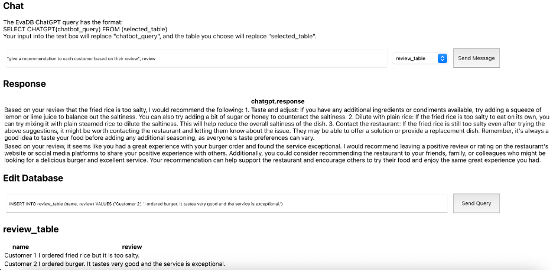

EvaDB ChatGPT UI

This app allows users to upload PostgreSQL data tables and query EvaDB’s ChatGPT data analyzer through a convenient UI.

Example Usage:

Setup instructions:\
Prerequisites:\
>    - You should already have a PostgreSQL database set up locally that you would like to use this app on\
>    - You should already be able to run Python and React apps from your computer
Set up dependencies virtual environment:\
>    - In a terminal at the root of the frontend folder, install dependencies by running the command:\
>>        o npm install\
>    - In a terminal at the root of the backend folder, create a Python virtual environment called evadb-venv by running the command:\
>>        o e.g. python -m venv evadb-venv\
>    - In the same terminal, activate the virtual environment by running the command:\
>>        o source evadb-venv/bin/activate\
>    - After setting up the virtual environment, in the same terminal located at the root of the backend folder, install dependencies by running the command:\
>>        o pip install -r requirements.txt\
Set up environment variables:\
>    - Create a .env.local file in the root of the frontend folder. This file should set the value of the backend server that the React app uses to contact the database.\
>>        o Example: REACT_APP_BACKEND_SERVER=http://127.0.0.1:5000\
>    - Create a .env file in the root of the backend folder. This file is where you should store your OpenAI key and your database’s name.\
>>        o Example:\
>>>            OPENAI_KEY=sk-…\
>>>            DATABASE_NAME=postgres_data\
Start the application:\
>    - To start the backend, in a terminal at the root of the backend folder, run:\
>>        o python app.py\
>    - To start the backend, in a terminal at the root of the frontend folder, run:\
>>        o npm start
